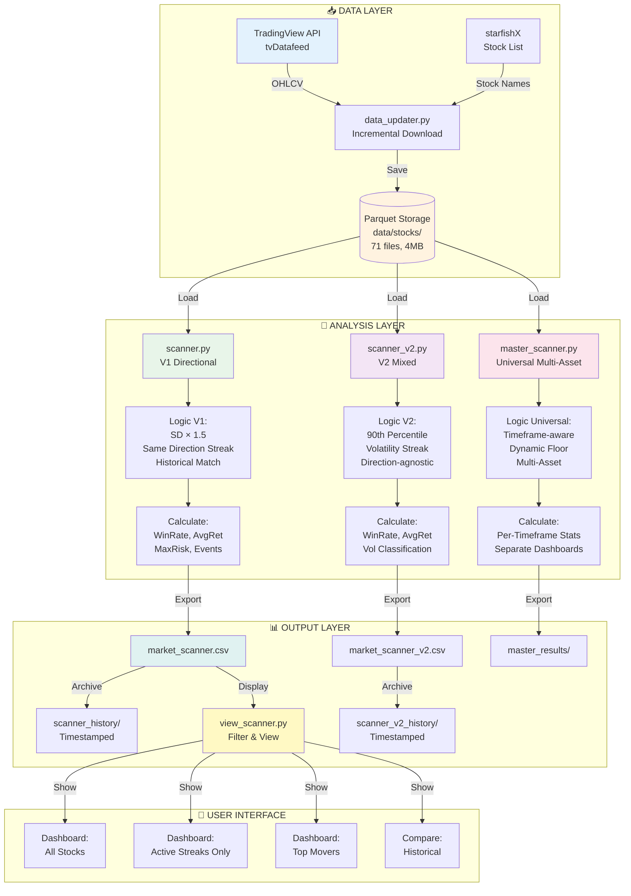
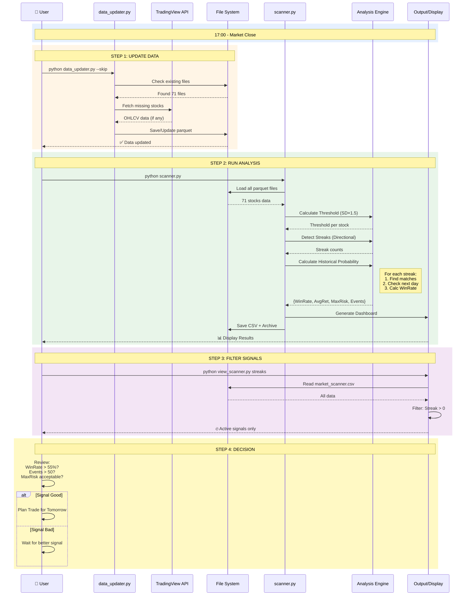
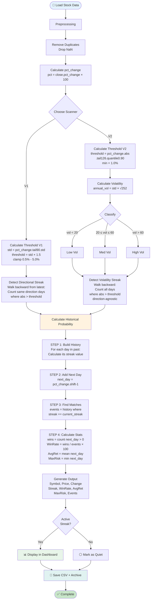
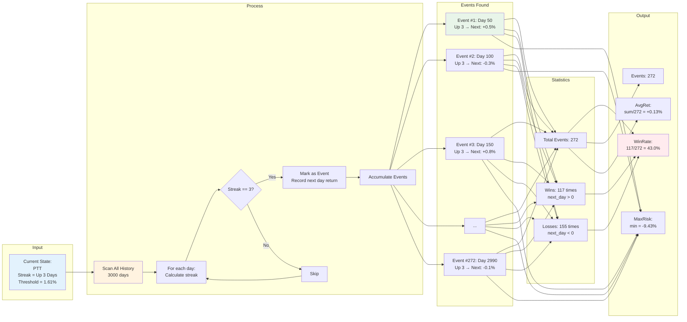
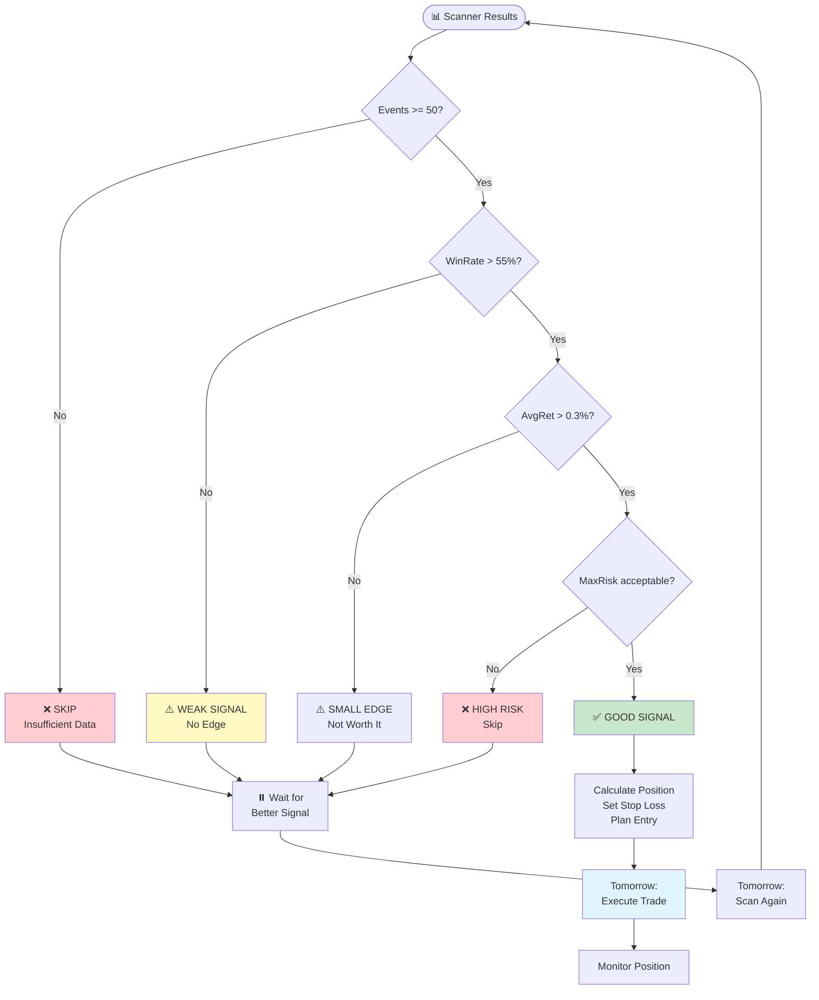
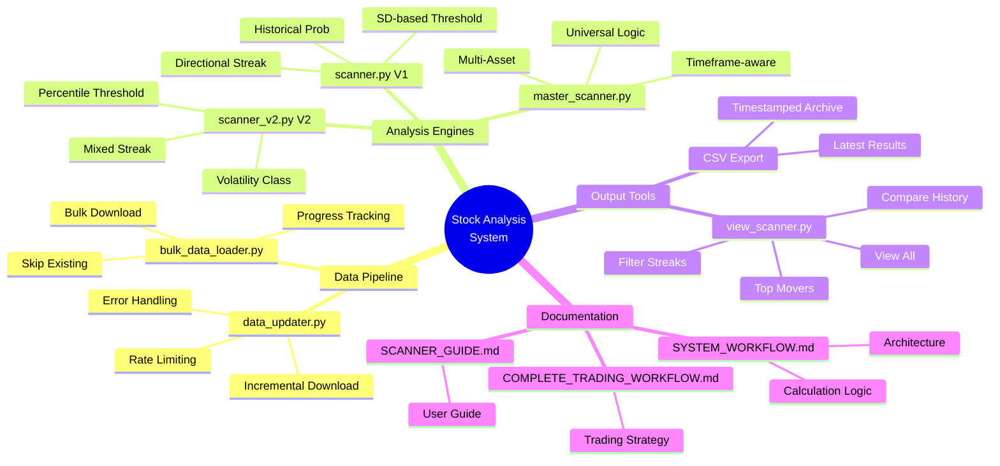

# ⚠️ DEPRECATED DOCUMENT
> **NOTE:** This document shows V1/V2 architecture. For the new V3.4 System Diagrams, please refer to section "System Architecture" in **[PROJECT_MASTER_MANUAL.md](PROJECT_MASTER_MANUAL.md)**.

# System Architecture - Mermaid Diagrams & Logic Explanation

## 🏗️ Complete System Architecture



---

## 🔄 Data Flow Sequence (Daily Workflow)



---

## 🧮 Calculation Logic Flow



---

## 📊 Historical Probability Calculation



---

## 🎯 Decision Tree



---

## 📈 Complete Daily Cycle

```mermaid
graph LR
    subgraph "Day N (Today)"
        D1[17:00 Market Close] --> D2[17:05 Update Data]
        D2 --> D3[17:10 Run Scanner]
        D3 --> D4[17:15 Filter Signals]
        D4 --> D5[17:30 Analysis]
        D5 --> D6{Good Signal?}
    end
    
    subgraph "Planning"
        D6 -->|Yes| P1[Calculate Position]
        P1 --> P2[Set Stop Loss]
        P2 --> P3[Plan Entry Price]
        P3 --> P4[Ready for Tomorrow]
        
        D6 -->|No| P5[Mark as Wait]
        P5 --> P4
    end
    
    subgraph "Day N+1 (Tomorrow)"
        P4 --> N1[09:00 Market Open]
        N1 --> N2{Execute?}
        N2 -->|Yes| N3[Enter Position]
        N2 -->|No| N4[Continue Monitoring]
        N3 --> N5[16:30 Monitor/Close]
        N4 --> N5
    end
    
    subgraph "Evening"
        N5 --> E1[17:00 Market Close]
        E1 --> E2[Update Data N+1]
        E2 --> E3[Scan for N+2]
    end
    
    E3 --> D1
    
    style D1 fill:#e3f2fd
    style D3 fill:#fff3e0
    style P1 fill:#e8f5e9
    style N3 fill:#c8e6c9
    style E3 fill:#f3e5f5
```



---

## 🔧 System Components Map



---

## ✅ Summary

**ระบบมี 3 Scanners:**

1. **V1 (Directional)** - Trend following
2. **V2 (Mixed)** - Volatility analysis  
3. **Universal** - Multi-asset, multi-timeframe

**Logic หลัก:**
1. Calculate Threshold (adaptive)
2. Detect Streak (directional or mixed)
3. Find Historical Matches
4. Calculate Probability
5. Display Results

**Daily Workflow:**
```
Update → Scan → Filter → Analyze → Decide → Execute → Repeat
```

**Ready for:** Live trading with proper risk management! 🚀
