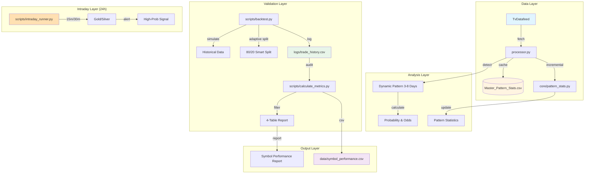
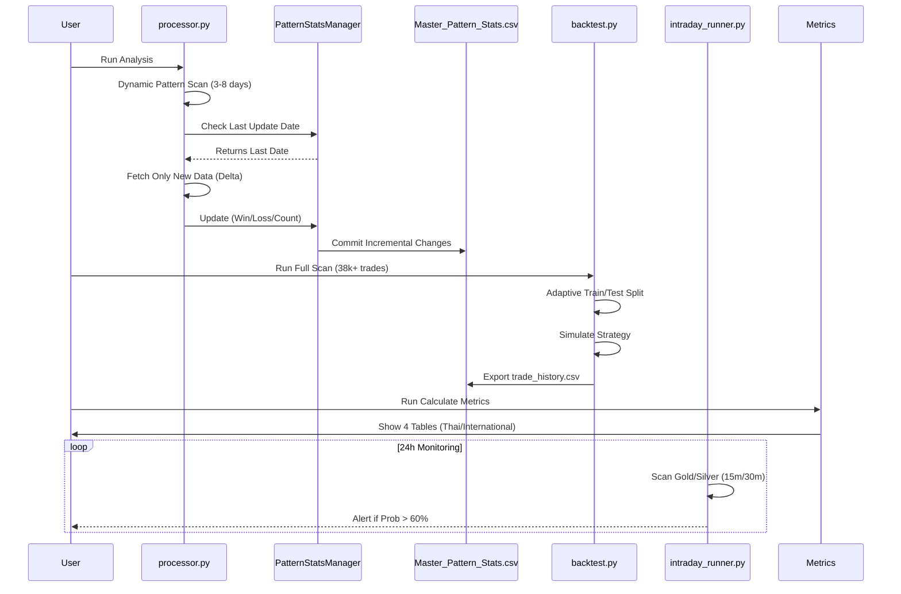

# System Workflow - Stock Analysis System (V3.4)

## 📐 System Architecture



---

## 🔄 Data Flow (V3.4)



---

## 📁 File Structure (V3.4)

```
predict/
├── core/                           # Core logic
│   ├── pattern_stats.py           # ✅ Incremental Stats Manager
│   ├── performance.py             # Performance Logging
│   └── ...
│
├── scripts/                        # User Scripts
│   ├── backtest.py                # ✅ Full Market Simulator (Dynamic 3-8 Days)
│   ├── calculate_metrics.py       # ✅ Pop & RR Calculator (4 Tables)
│   ├── intraday_runner.py         # ✅ NEW: 24h Gold/Silver Monitor
│   ├── fact_check.py              # Audit Tool
│   └── view_report.py             # Single Stock Viewer
│
├── logs/                          # Logs
│   └── trade_history.csv          # ✅ Detailed Trade Logs (38k+ rows)
│
├── data/                          # Data Storage
│   ├── Master_Pattern_Stats.csv   # Pattern Knowledge Base
│   └── symbol_performance.csv     # ✅ Final Screener Results
│
└── docs/                          # Documentation
    └── SYSTEM_WORKFLOW.md         # This file
```

---

## ⚙️ Key Components (V3.4)

### **1. Dynamic Pattern Detection (NEW in V3.4)**
```
File: processor.py

Features:
✅ Dynamic Length: Scans patterns from 3 to 8 days
✅ Max Effective Length: Selects the LONGEST pattern that exceeds threshold
✅ Adaptive: Each stock gets its optimal pattern length automatically

Logic:
- Extract current market "tail" (last 3-8 bars)
- Scan history for matching patterns at EACH length
- Select longest one with Probability > 55% (or fallback to longest available)
```

### **2. Adaptive Backtest Engine (NEW in V3.4)**
```
File: scripts/backtest.py

Features:
✅ Dynamic Split: 80% Train / 20% Test for short-history stocks
✅ Min Threshold: 220 bars minimum (was 1000)
✅ Auto-Reconnect: Handles network drops during long scans
✅ Includes New Stocks: TRUE, AWC, OR now pass validation

Usage:
python scripts/backtest.py --full 5000  # Run all stocks, 5000 bars
```

### **3. 4-Table Metrics Report (Enhanced in V3.4)**
```
File: scripts/calculate_metrics.py

Features:
✅ Min 30 Signals Filter: Removes statistically weak candidates
✅ Table 1 (Thai Strict):   Prob > 60%, RR > 2.0   (The Elite)
✅ Table 2 (Thai Balanced): Prob > 60%, RR > 1.5   (The Core)
✅ Table 3 (Intl Observe):  Prob > 55%, RR > 1.1   (Global Candidates)
✅ Table 4 (Intl Sensitivity): Prob > 50%, RR > 0.5 (Deep Dive)

Usage:
python scripts/calculate_metrics.py
```

### **4. Intraday Scanner (NEW in V3.4)**
```
File: scripts/intraday_runner.py

Features:
✅ 24h Monitoring: Runs continuously for Gold/Silver
✅ Multi-Timeframe: 15-minute and 30-minute intervals
✅ Auto-Alert: Prints signal when Prob > 60%

Usage:
python scripts/intraday_runner.py  # Runs forever, Ctrl+C to stop
```

---

## 📊 Calculation Logic (Verified)

### **1. Risk-Reward Ratio (RR)**
สูตรที่ได้รับการยืนยันจาก User:
```python
RR = Avg(Real Profit) / Avg(Real Loss)
```
*   **Real Profit:** กำไรที่เกิดขึ้นจริงเมื่อทายถูก
*   **Real Loss:** ขาดทุนที่เกิดขึ้นจริงเมื่อทายผิด

### **2. Probability (Prob%)**
*   **Formula:** `Wins / Total Occurrences`
*   **Note:** คัดเฉพาะ Pattern ที่มีความเชื่อมั่นสูง

### **3. Dynamic Pattern Selection (V3.4)**
*   **Scan:** Lengths 3, 4, 5, 6, 7, 8 days
*   **Select:** Longest pattern with Prob > 55%
*   **Fallback:** If none exceed threshold, use longest available

---

## 📈 Version History

| Version | Key Changes |
|---------|-------------|
| V3.3    | Incremental Stats, Screener Tables |
| V3.4    | **Dynamic Pattern (3-8 days), Adaptive Split, Intraday Scanner** |

---

## 📝 Summary

**ระบบ V3.4 คือ "Adaptive Intelligence"**
*   เปลี่ยนจาก Fixed Pattern 4 วัน เป็น Dynamic 3-8 วัน
*   รองรับหุ้นใหม่ (IPO) ด้วย Adaptive Split
*   ครอบคลุมตลาดโลก (Thai + US + China + HK + Taiwan)
*   เพิ่มระบบ Intraday สำหรับ Gold/Silver (24h)
*   ระบบเสถียร พร้อมใช้งานจริงแบบ Production

---

