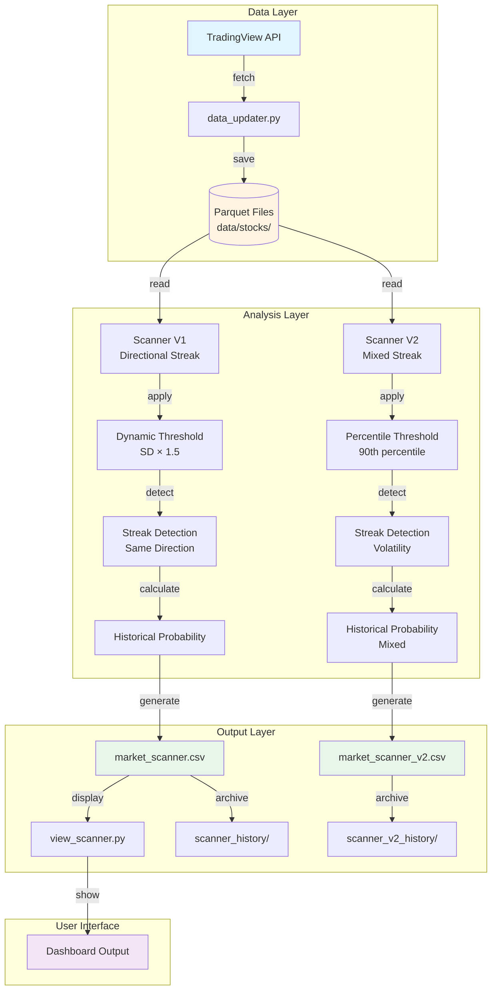
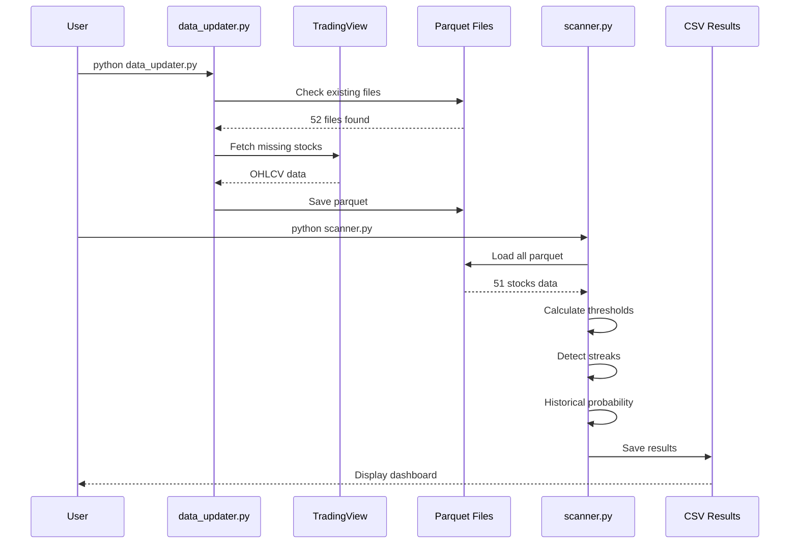
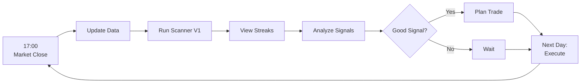
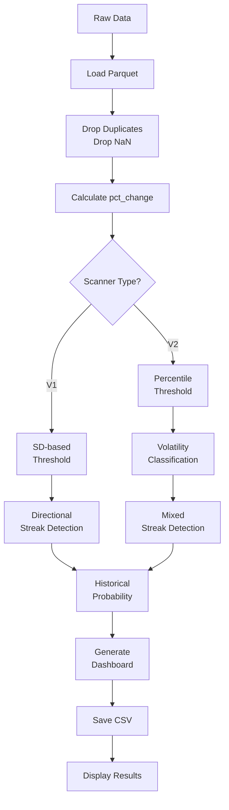

# System Workflow - Stock Analysis System

## 📐 System Architecture



---

## 🔄 Data Flow



---

## 📁 File Structure

```
predict/
├── core/                           # Core analysis modules
│   ├── data_fetcher.py            # Fetch data from APIs
│   ├── statistics.py              # Statistical calculations
│   ├── prediction.py              # Prediction logic
│   └── dynamic_streak_v2.py       # V2 streak detection
│
├── pipeline/                       # Data pipeline scripts
│   ├── data_updater.py            # Main updater (incremental)
│   ├── data_cleaner.py            # Data cleaning
│   └── batch_processor.py         # Batch operations
│
├── scripts/                        # User-facing scripts
│   ├── scanner.py                 # V1 Scanner (Directional)
│   ├── scanner_v2.py              # V2 Scanner (Mixed)
│   └── view_scanner.py            # View/filter results
│
├── data/                          # Data storage
│   └── stocks/                    # Parquet files
│       ├── PTT_SET.parquet        # 52 stocks
│       ├── DELTA_SET.parquet
│       └── ...
│
├── results/                       # Output results
│   ├── market_scanner.csv         # V1 latest
│   ├── market_scanner_v2.csv      # V2 latest
│   ├── scanner_history/           # V1 archives
│   └── scanner_v2_history/        # V2 archives
│
└── docs/                          # Documentation
    └── guides/
        ├── SCANNER_GUIDE.md
        ├── SCANNER_CALCULATIONS_EXPLAINED.md
        └── COMPLETE_TRADING_WORKFLOW.md
```

---

## ⚙️ Component Details

### **1. Data Updater**
```
File: pipeline/data_updater.py

Features:
✅ Incremental download (skip existing)
✅ Rate limiting (1 sec/stock)
✅ Error handling
✅ Parquet storage

Usage:
python pipeline/data_updater.py          # Incremental
python pipeline/data_updater.py --full   # Full update
python pipeline/data_updater.py --skip   # Skip existing
```

### **2. Scanner V1 (Directional)**
```
File: scripts/scanner.py

Logic:
1. Threshold = SD × 1.5 (90 days)
2. Streak = Same direction consecutive days
3. Historical Prob = Match exact pattern

Features:
✅ Directional streaks (Up/Down)
✅ Win Rate calculation
✅ Risk metrics
✅ CSV export + archive

Usage:
python scripts/scanner.py
```

### **3. Scanner V2 (Mixed)**
```
File: scripts/scanner_v2.py

Logic:
1. Threshold = 90th percentile (126 days)
2. Volatility = Annual SD × √252
3. Streak = Any significant move (direction-agnostic)

Features:
✅ Volatility classification (Low/Med/High)
✅ Mixed streak detection
✅ Percentile-based threshold

Usage:
python scripts/scanner_v2.py
```

### **4. Viewer**
```
File: scripts/view_scanner.py

Commands:
python scripts/view_scanner.py           # View all
python scripts/view_scanner.py streaks   # Active only
python scripts/view_scanner.py top 10    # Top movers
python scripts/view_scanner.py compare   # Compare history
```

---

## 🔄 Daily Workflow



### **Detailed Steps**

```
17:00 - Market closes
│
├─ 17:05: Update Data
│  └─ python pipeline/data_updater.py --skip
│     → Incremental update (fast)
│
├─ 17:10: Run Scanner
│  └─ python scripts/scanner.py
│     → Analyze 51 stocks
│     → Generate probability
│
├─ 17:15: Filter Signals
│  └─ python scripts/view_scanner.py streaks
│     → Show active streaks only
│
├─ 17:30: Manual Analysis
│  └─ Review WinRate, AvgRet, MaxRisk, Events
│     → Filter: WinRate > 55%, Events > 50
│
├─ 17:45: Trading Decision
│  └─ If signal good → Plan trade
│     → If signal bad → Wait
│
└─ Next Day 09:00: Execute
   → Enter position
   → Set stop loss
   → Monitor
```

---

## 📊 Data Processing Pipeline



---

## 🧮 Calculation Logic Explained

### **วิธีคำนวณแต่ละค่าในตาราง**

#### **1. Threshold (เกณฑ์ความสำคัญ)**

**V1 (SD-based):**
```python
# ใช้ Standard Deviation × 1.5
recent_90_days = df['pct_change'].tail(90)
std = recent_90_days.std()
threshold = std * 1.5
threshold = max(0.5, min(threshold, 5.0))  # จำกัด 0.5-5%
```

**ตัวอย่าง:**
```
PTT ใน 90 วันที่ผ่านมา:
วันที่ 1: +2.0%
วันที่ 2: -1.5%
วันที่ 3: +0.8%
...
วันที่ 90: +1.2%

SD = 1.07%
Threshold = 1.07 × 1.5 = 1.61%

→ การเปลี่ยนแปลง > 1.61% = "มีนัยสำคัญ"
```

**V2 (Percentile):**
```python
# ใช้ 90th percentile
recent_126_days = df['pct_change'].abs().tail(126)
threshold = recent_126_days.quantile(0.90)
threshold = max(threshold, 1.0)  # ขั้นต่ำ 1%
```

---

#### **2. Streak (ลำดับติดต่อกัน)**

**Directional Streak (V1):**
```python
def detect_directional_streak(df, threshold):
    streak = 0
    current_direction = None
    
    # เดินย้อนจากวันล่าสุด
    for i in range(len(df)-1, -1, -1):
        change = df.iloc[i]['pct_change']
        
        # กำหนดทิศทาง
        if change > threshold:
            direction = 'UP'
        elif change < -threshold:
            direction = 'DOWN'
        else:
            break  # ไม่เกิน threshold → หยุด
        
        # เช็คทิศทางเดียวกันไหม
        if current_direction is None:
            current_direction = direction
            streak = 1
        elif current_direction == direction:
            streak += 1
        else:
            break  # ทิศทางเปลี่ยน → หยุด
    
    return streak, current_direction
```

**ตัวอย่าง:**
```
Threshold = 1.61%

วันที่ 10: +3.15% > 1.61% → Up ✅
วันที่ 11: +2.50% > 1.61% → Up ✅
วันที่ 12: +2.10% > 1.61% → Up ✅
วันที่ 13: +0.80% < 1.61% → Break! ❌

Streak = Up 3 Days
```

**Volatility Streak (V2):**
```python
# ไม่สนทิศทาง นับทุกวันที่ผันผวนเกิน threshold
วันที่ 10: +3.15% → significant ✅
วันที่ 11: -2.50% → significant ✅ (ต่างทิศทางก็นับ!)
วันที่ 12: +2.10% → significant ✅
วันที่ 13: +0.80% → not significant ❌

Streak = 3 (Volatility streak)
```

---

#### **3. Historical Probability Engine**

**Step-by-Step Process:**

```python
def calculate_historical_probability(df, current_streak, threshold):
    """
    หา pattern เดียวกันในอดีต แล้วดูว่าวันถัดไปเป็นอย่างไร
    """
    
    # STEP 1: คำนวณ streak สำหรับทุกวันในประวัติศาสตร์
    df['streak'] = 0
    
    for i in range(len(df)):
        # คำนวณ streak ณ วันที่ i
        streak = 0
        for j in range(i, -1, -1):
            if abs(df.iloc[j]['pct_change']) > threshold:
                streak += 1
            else:
                break
        df.iloc[i, df.columns.get_loc('streak')] = streak
    
    # STEP 2: เพิ่ม column "วันถัดไป"
    df['next_day_return'] = df['pct_change'].shift(-1)
    
    # STEP 3: หา events ที่ match
    # (ไม่เอาวันล่าสุด เพราะยังไม่รู้วันถัดไป)
    history = df.iloc[:-1].copy()
    matching_events = history[history['streak'] == current_streak]
    matching_events = matching_events.dropna(subset=['next_day_return'])
    
    # STEP 4: คำนวณสถิติ
    wins = matching_events[matching_events['next_day_return'] > 0]
    win_rate = (len(wins) / len(matching_events)) * 100
    avg_return = matching_events['next_day_return'].mean()
    max_risk = matching_events['next_day_return'].min()
    
    return {
        'win_rate': win_rate,
        'avg_return': avg_return,
        'max_risk': max_risk,
        'events': len(matching_events)
    }
```

---

#### **4. WinRate (อัตราชนะ)**

**ตัวอย่างละเอียด:**

```
Current: PTT มี streak = "Up 3 Days" วันนี้

ค้นหาในประวัติศาสตร์:

วันที่ 50-52: Up, Up, Up (streak=3) → Next day: +0.5% ✅
วันที่ 100-102: Up, Up, Up (streak=3) → Next day: -0.3% ❌
วันที่ 150-152: Up, Up, Up (streak=3) → Next day: +0.8% ✅
วันที่ 200-202: Up, Up, Up (streak=3) → Next day: +0.2% ✅
...
วันที่ 2990-2992: Up, Up, Up (streak=3) → Next day: -0.1% ❌

Events = 272 ครั้ง
Wins = 117 ครั้ง (วันถัดไปเป็นบวก)
Losses = 155 ครั้ง (วันถัดไปเป็นลบ)

WinRate = (117 / 272) × 100 = 43.0%
```

**ความหมาย:**
- WinRate 43% = ถ้าเจอ pattern นี้ พรุ่งนี้มีโอกาส 43% ที่จะขึ้น
- WinRate 50% = Random (เหมือนโยนเหรียญ)
- WinRate > 55% = มี Edge (น่าสนใจ)

---

#### **5. AvgRet (Return เฉลี่ย)**

**ตัวอย่าง:**

```
จาก Events 272 ครั้ง ดูวันถัดไป:

Event #1: +0.5%
Event #2: -0.3%
Event #3: +0.8%
Event #4: +0.2%
...
Event #272: -0.1%

ผลรวม = +35.36%
AvgRet = 35.36 / 272 = +0.13%
```

**ความหมาย:**
- AvgRet +0.13% = โดยเฉลี่ยพรุ่งนี้มักขึ้น 0.13%
- AvgRet ใกล้ 0 = ไม่มี Edge ชัดเจน
- AvgRet > 0.5% = มี Edge ดี

---

#### **6. MaxRisk (ความเสี่ยงสูงสุด)**

**ตัวอย่าง:**

```
จาก Events 272 ครั้ง หาค่าต่ำสุด:

All returns: +0.5%, -0.3%, +0.8%, ..., -9.43%, ..., -0.1%
                                         ↑
                                    Worst case

MaxRisk = -9.43%
```

**ความหมาย:**
- MaxRisk -9.43% = ในกรณีแย่ที่สุด ขาดทุน 9.43%
- ใช้ตั้ง Stop Loss
- ประเมิน Position Size

---

#### **7. Events (จำนวนครั้ง)**

**ตัวอย่าง:**

```python
# นับจำนวนครั้งที่เคยเกิด pattern นี้

current_streak = 3  # Up 3 Days

events = 0
for i in range(len(history)):
    if history.iloc[i]['streak'] == 3:
        events += 1

# Result: events = 272
```

**ความหมาย:**
- Events 272 = เคยเกิด pattern นี้ 272 ครั้ง
- Events สูง = ข้อมูลเยอะ → น่าเชื่อถือ
- Events < 30 = ข้อมูลน้อย → ไม่แน่ใจ

**แนวทาง:**
```
Events >= 50  → น่าเชื่อถือ ✅
Events 30-50  → ระมัดระวัง ⚠️
Events < 30   → ควรข้าม ❌
```

---

### **ตัวอย่างสมบูรณ์**

```
Input:
- PTT วันนี้ปิด 32.75 (+3.15%)
- Streak = Up 3 Days
- Threshold = 1.61%

Process:
1. หา Events = ค้นประวัติศาสตร์ 3000 วัน
   → เจอ "Up 3 Days" ทั้งหมด 272 ครั้ง

2. ดูวันถัดไปของแต่ละ Event:
   Wins (บวก): 117 ครั้ง
   Losses (ลบ): 155 ครั้ง

3. คำนวณ:
   WinRate = 117/272 = 43.0%
   AvgRet = sum(all returns) / 272 = +0.13%
   MaxRisk = min(all returns) = -9.43%
   Events = 272

Output:
Symbol  Streak       WinRate  AvgRet  MaxRisk  Events
PTT     Up 3 Days    43.0%    +0.13%  -9.43%   272

Interpretation:
- โอกาส 43% ขึ้น (ต่ำกว่า 50% = ไม่ดี)
- เฉลี่ยได้ 0.13% (น้อย)
- Risk สูงสุด -9.43% (สูง!)
- ข้อมูล 272 ครั้ง (เยอะ ✅)

Decision: ไม่ควรเข้า (WinRate ต่ำ, Risk สูง)
```

---

## 🎯 Output Format

### **Scanner V1 Output**
```
Symbol  Price   Change  Streak       Thres. WinRate AvgRet MaxRisk Events
PTT     ฿32.75  +3.15%  Up 3 Days    1.61%   43.0% +0.13% -9.43%  272
SCC     ฿206    +4.39%  Up 1 Days    2.55%   65.0% +0.80% -3.20%  150
BDMS    ฿18.40  +2.22%  Up 2 Days    2.05%   50.0% +0.36% -2.11%   16
```

### **Scanner V2 Output**
```
Symbol  Price   Change  Streak         Vol_Type Thres. WinRate AvgRet
PTT     ฿32.75  +3.15%  Up (Vol 1)     Med      1.61%   46.6% +0.00%
DELTA   ฿160    +0.31%  Quiet          Med      4.56%    0.0% +0.00%
THAI    ฿6.90   +2.22%  Quiet          High     8.00%    0.0% +0.00%
```

---

## 🔧 System Capabilities

### ✅ **มีแล้ว (Implemented)**

1. **Data Management**
   - Incremental download
   - Parquet storage (4MB for 52 stocks)
   - Auto deduplication
   - Error handling

2. **Analysis**
   - 2 Scanner versions (V1/V2)
   - Adaptive thresholds
   - Streak detection
   - Historical probability
   - Volatility classification

3. **Output**
   - CSV export
   - Timestamped archives
   - Dashboard display
   - Filter/view tools

4. **Documentation**
   - Calculation guides
   - Trading workflows
   - System architecture

### ❌ **ยังไม่มี (Not Implemented)**

1. **Automation**
   - Auto signal generation
   - Position sizing calculator
   - Trade execution API
   - Notification system

2. **Advanced Analytics**
   - Backtesting engine
   - Performance tracking
   - Strategy optimization
   - Risk management system

3. **Visualization**
   - Charts/graphs
   - Interactive dashboard
   - Real-time monitoring

---

## 📝 Summary

**ระบบปัจจุบัน = Complete Analysis Pipeline**

```
Input: TradingView data
Process: Threshold → Streak → Probability
Output: Trading signals with statistics
```

**Workflow: Daily N+1 Analysis**
```
Update Data → Analyze → Filter → Decide → Execute → Repeat
```

**Ready for:** Manual trading decisions
**Need to add:** Automation & backtesting
