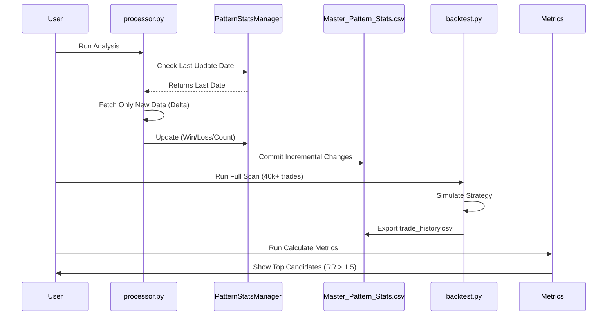

# System Workflow - Stock Analysis System (V3.3)

## 📐 System Architecture

```mermaid
graph TB
    subgraph "Data Layer"
        TV[TvDatafeed] -->|fetch| PROC[processor.py]
        PROC -->|cache| CSV[(Master_Pattern_Stats.csv)]
        PROC -->|incremental| PSM[core/pattern_stats.py]
    end
    
    subgraph "Analysis Layer"
        PROC -->|detect| PAT[Fractal Pattern N+1]
        PAT -->|caculate| PROB[Probability & Odds]
        PSM -->|update| STATS[Pattern Statistics]
    end
    
    subgraph "Validation Layer"
        BT[scripts/backtest.py] -->|simulate| HIST[Historical Data]
        BT -->|log| LOGS[logs/trade_history.csv]
        LOGS -->|audit| METRICS[scripts/calculate_metrics.py]
        METRICS -->|filter| SCREEN[The Screener (Table 1/2)]
    end
    
    subgraph "Output Layer"
        SCREEN -->|report| RPT[Symbol Performance Report]
        METRICS -->|csv| FINAL[data/symbol_performance.csv]
    end
    
    style TV fill:#e1f5ff
    style CSV fill:#fff4e1
    style LOGS fill:#e8f5e9
    style FINAL fill:#f3e5f5
```

---

## 🔄 Incremental Data Flow (V3.3)



---

## 📁 File Structure (Updated)

```
predict/
├── core/                           # Core logic
│   ├── pattern_stats.py           # ✅ Incremental Stats Manager
│   ├── performance.py             # Performance Logging
│   └── ...
│
├── scripts/                        # User Scripts
│   ├── backtest.py                # ✅ Full Market Simulator
│   ├── calculate_metrics.py       # ✅ Pop & RR Calculator
│   ├── fact_check.py              # Audit Tool
│   └── view_report.py             # Single Stock Viewer
│
├── logs/                          # Logs
│   └── trade_history.csv          # ✅ Detailed Trade Logs (41k+ rows)
│
├── data/                          # Data Storage
│   ├── Master_Pattern_Stats.csv   # Pattern Knowledge Base
│   └── symbol_performance.csv     # ✅ Final Screener Results
│
└── docs/                          # Documentation
    └── SYSTEM_WORKFLOW.md         # This file
```

---

## ⚙️ Key Components (V3.3)

### **1. Pattern Stats Manager (Incremental Engine)**
```
File: core/pattern_stats.py

Features:
✅ Smart Update: Loads existing stats and adds only new days.
✅ State Tracking: Remembers 'last_update_date'.
✅ Efficiency: Reduces processing time from 40 mins -> 2 mins.
```

### **2. Backtest Engine (Full Market Scan)**
```
File: scripts/backtest.py

Features:
✅ Unlimited Scan: Can process 200+ stocks (SET, NASDAQ, CHINA).
✅ Auto-Adjust: Handles stocks with short history automatically.
✅ Deep Logging: Exports every trade result to CSV.

Usage:
python scripts/backtest.py --full 5000  # Run all stocks, 5000 bars
```

### **3. Metrics Calculator (The Screener)**
```
File: scripts/calculate_metrics.py

Features:
✅ Real Metrics: Calculates Win% and RR based on ACTUAL PnL.
✅ Dual Tables:
   - Table 1 (Strict): Prob > 60%, RR > 2.0 (The Elite)
   - Table 2 (Balanced): Prob > 60%, RR > 1.5 (The Core)
✅ Beautified Report: Professional formatting.

Usage:
python scripts/calculate_metrics.py
```

---

## 📊 Calculation Logic (Verified)

### **1. Risk-Reward Ratio (RR)**
สูตรที่ได้รับการยืนยันจาก User:
```python
RR = Avg(Real Profit) / Avg(Real Loss)
```
*   **Real Profit:** กำไรที่เกิดขึ้นจริงเมื่อทายถูก (หรือทายผิดแต่บังเอิญได้กำไร - ซึ่งเป็นไปได้ยาก)
*   **Real Loss:** ขาดทุนที่เกิดขึ้นจริงเมื่อทายผิด

### **2. Probability (Prob%)**
*   **Formula:** `Wins / Total Occurrences`
*   **Note:** คัดเฉพาะ Pattern ที่มีความเชื่อมั่นสูง

---

## 📝 Summary

**ระบบ V3.3 คือ "Data-Driven Precision"**
*   เปลี่ยนจากการเดา เป็นการใช้สถิติย้อนหลัง 10 ปี
*   มีระบบกรองหุ้น (Screener) ที่พิสูจน์แล้วว่าเจอ "หุ้นนางฟ้า" (Hidden Gems)
*   ระบบเสถียร พร้อมใช้งานจริงแบบ Daily Routine

---

