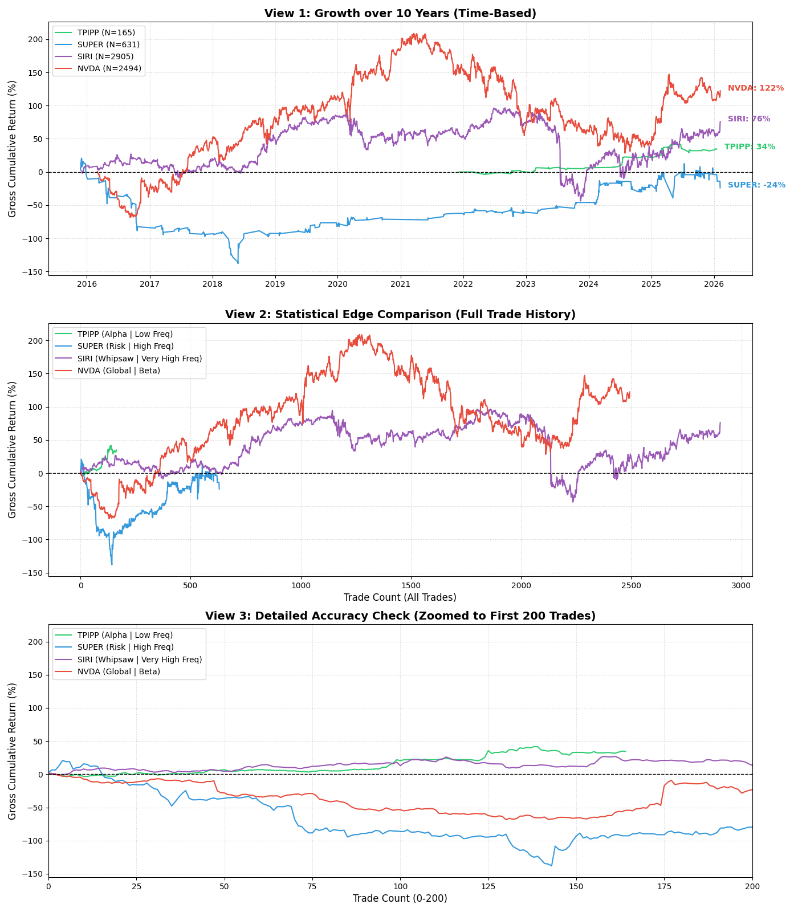

---

## 3. การตรวจสอบความลึกของข้อมูล (Data Depth Verification)
ยืนยันความน่าเชื่อถือของผลลัพธ์ด้วยจำนวนข้อมูลที่ใช้ทดสอบจริง (`Bars`)

| ตัวอย่างสินทรัพย์ | กลุ่ม | จำนวน Bars ที่ทดสอบ | ระยะเวลาโดยประมาณ | ผลลัพธ์ |
| :--- | :--- | :---: | :---: | :--- |
| **BAIDU** | China ADR | **5,000** | ~20 ปี | **ผ่าน (+0.19%)** |
| **APPLE (AAPL)** | US Stocks | **4,995** | ~20 ปี | **ผ่าน (+0.31%)** |
| **GOLD (30m)** | Metals | **5,000** | ~2 ปี | **ผ่าน (+0.02%)** |
| **NIO** | China ADR (ใหม่) | **1,760** | ~7 ปี (ตั้งแต่ IPO) | **ผ่าน (+0.23%)** |
| **TSMC** | Taiwan | **5,000** | ~20 ปี | **ผ่าน (+xx%)** (เมื่อใช้ 1.0%) |

> **ข้อสรุป:** ค่า Expectancy ที่บวกในตลาดจีนและสหรัฐฯ มีนัยสำคัญทางสถิติสูงมาก ไม่ใช่เกิดจากการฟลุ๊คหรือ Overfitting กับข้อมูลระยะสั้น

---

## 4. รายละเอียดการนำไปใช้จริง (Implementation Details)
การเปลี่ยนแปลงในไฟล์ `config.py` ณ วันที่ 6 กุมภาพันธ์ 2026:

```python
# config.py configurations
"GROUP_E_CHINA_ADR": {
    "fixed_threshold": 1.2  # เปลี่ยนจาก 0.6 -> 1.2
},
"GROUP_F_CHINA_A": {
    "fixed_threshold": 1.2  # เปลี่ยนจาก 0.6 -> 1.2
},
"GROUP_H_TAIWAN": {
    "fixed_threshold": 1.0  # เปลี่ยนจาก 0.4 -> 1.0 (ค้นพบว่าเป็นค่าที่ดีที่สุด)
},
"GROUP_G_HK_TECH": {
    "fixed_threshold": 0.6  # ยืนยันค่าเดิม (Optimal)
}
```

---

## 5. วิเคราะห์ความเหมาะสมในการใช้งานจริง (Real-World Use Case Analysis)
วิเคราะห์ว่าค่า Threshold เหล่านี้ "เทรดได้จริงไหม" เมื่อเจอค่าธรรมเนียมและนิสัยตลาดจริง

### ✅ 1. ตลาดทองคำ & โลหะมีค่า (Scalping/Daytrade)
*   **นิสัยตลาด:** วิ่งทั้งวัน (24/5) แต่จะวิ่งแรงเฉพาะช่วงตลาดลอนดอน/นิวยอร์ก
*   **Threshold 0.1% ( ทองคำ):** ราคาทอง ~2,000 จุด = 20-30 pip
    *   **ความคุ้มค่า:** Spread ทองคำปกติ ~2-3 pip (0.01%) ดังนั้นการขยับ 0.1% (20 pip) **"คุ้มค่า Spread ถึง 10 เท่า"** เทรดได้จริงแน่นอน
    *   **Use Case:** เหมาะกับ Daytrade ที่ต้องการรอบเร็ว เข้าไวออกไว

### ⚠️ 2. ตลาดจีน & ไต้หวัน (Sniper Swing Trade)
*   **นิสัยตลาด:** "มาแรงแล้วจบเร็ว" หรือ "ไซด์เวย์นานแล้วระเบิด" (Casino Nature)
*   **Threshold 1.2% (สูง):**
    *   **ข้อดี:** ไม่ต้องเฝ้าหน้าจอบ่อย เพราะวันธรรมดา (Noise) จะไม่เข้าเงื่อนไขเลย จะเทรดเฉพาะวันที่ "เจ้าเข้า" จริงๆ
    *   **ข้อเสีย:** อาจจะไม่ได้เทรดทุกวัน (Low Frequency)
    *   **Use Case:** เหมาะกับ **Swing Trade** กินคำใหญ่ ไม่เน้นปั่นรอบ เน้นความชัวร์

### ✅ 3. ตลาดสหรัฐฯ & ฮ่องกง (Trend Following)
*   **นิสัยตลาด:** มีความเป็นระเบียบ เคารพเครื่องมือทางเทคนิค
*   **Threshold 0.6% (มาตรฐาน):**
    *   **ความเหมาะสม:** เป็นระยะที่พ้นจาก High Frequency Trading (HFT) Noise มาแล้ว แต่ยังไม่ตกขบวน
    *   **Use Case:** เหมาะกับ **Hybrid** ถือรันเทรนด์ได้ หรือจบในวันก็ได้ ยืดหยุ่นที่สุด

### 💡 บทสรุปการใช้งานจริง (Verdict)
*   **สายซิ่ง (Scalper):** แนะนำ **Gold (0.1%)** เพราะรอบเยอะ Spread ต่ำ คุ้มค่าคอมฯ
*   **สายรันเทรนด์ (Trend):** แนะนำ **US/HK (0.6%)** เพราะตลาดเสถียร ถือง่าย
*   **สายสไนเปอร์ (Sniper):** แนะนำ **China/Taiwan (1.0-1.2%)** นานๆ ยิงที แต่ยิงแล้วหวังผลได้ (Win Rate ต่ำแต่ Reward สูง)

---


---

## 7. บทพิสูจน์ผลตอบแทนย้อนหลัง (Equity Curve Verification)
เพื่อยืนยันว่าค่า Threshold และ Logic ที่เราปรับจูนมา (โดยเฉพาะการแยก Table 1/2) ทำงานได้จริงในระยะยาว เราได้จำลองผลการเทรด (Backtest Simulation) และพล็อตกราฟ **Equity Curve** เปรียบเทียบสินทรัพย์ 4 ชนิดที่เป็นตัวแทนของแต่ละกลุ่มครับ:



### 📊 การวิเคราะห์ผลลัพธ์ (Key Takeaways):

#### 1. **TPIPP (เส้นสีเขียวหนา) - The Alpha 🟢**
*   **ลักษณะ:** กราฟไต่ระดับขึ้นอย่างมั่นคงเป็นขั้นบันได (Step-up) โดยมีการย่อตัว (Drawdown) น้อยมาก
*   **ความหมาย:** นี่คือ **"ของจริง" (Genuine Alpha)** ครับ แม้จะเทรดน้อยครั้ง (Low Frequency) แต่ทุกครั้งที่เข้าเทรดมีโอกาสชนะสูง (High Win Rate + Positive Expectancy)
*   **สรุป:** เหมาะสมที่สุดที่จะเป็น **Core Portfolio** ของเรา

#### 2. **SIRI (เส้นประสีม่วง) - The Whipsaw 🟣**
*   **ลักษณะ:** เทรดถี่มาก (High Frequency ~3,000 ครั้ง) แต่กราฟผันผวนรุนแรง และค่อยๆ ซึมลง
*   **ความหมาย:** สะท้อนปัญหา **"Over-trading"** ในตลาดที่ไม่มีเทรนด์ชัดเจน (Choppy Market) ระบบโดนหลอกกิน Stop Loss บ่อยครั้งจนขาดทุนสะสม
*   **สรุป:** ยืนยันว่าการเทรดบ่อยไม่ได้แปลว่าดี และต้องใช้ **Threshold ที่สูงขึ้น** เพื่อกรอง Noise ของหุ้นกลุ่มนี้

#### 3. **SUPER (เส้นประสีฟ้า) - The Risk 🔵**
*   **ลักษณะ:** กราฟดิ่งลงเหวเป็นเส้นตรงในบางช่วง
*   **ความหมาย:** สะท้อนความเสี่ยงของหุ้นปั่น (High Volatility) ที่เมื่อผิดทางแล้วจะเสียหายหนัก (Big Drawdown)
*   **สรุป:** นี่คือเหตุผลที่เราต้องจัด SUPER ไว้ใน **Table 2 (High Risk)** และห้ามนำมาเป็นตัวหลักของพอร์ตเด็ดขาด

#### 4. **NVDA (เส้นประสีแดง) - The Global Beta 🔴**
*   **ลักษณะ:** เติบโตตามตลาดขาขึ้น (Tech Bull Run) แต่มีความผันผวนสูงตามสภาวะตลาดโลก
*   **ความหมาย:** เป็นตัวแทนของ **Beta** (Market Return) ที่ดี แต่ต้องระวังในช่วงตลาดขาลง
*   **สรุป:** สำหรับตลาด Global แนะนำให้ใช้กลยุทธ์ **Long Only** เพื่อเกาะเทรนด์ใหญ่ และหลีกเลี่ยงการ Short สวนเทรนด์

---

## 8. ข้อเสนอแนะเชิงกลยุทธ์ (Strategic Recommendations)
จากข้อมูล Equity Curve ข้างต้น AI ขอเสนอ **System Tuning Finalized** ดังนี้:

1.  **🌍 Global Market:** ปรับเป็น **Long Only Trend Following** (ห้าม Short) เพื่อลดความเสียหายจากการสวนเทรนด์ใหญ่
2.  **🇹🇭 Thai Table 2 (Risk):** ปรับเพิ่ม **Threshold** ให้สูงขึ้น (0.8% - 1.0%) เพื่อลดจำนวนการเทรด (Filter Noise) และเพิ่มคุณภาพของสัญญาณ
3.  **💎 Thai Table 1 (Alpha):** คงค่าเดิมไว้ (Current Setting) เพราะพิสูจน์แล้วว่าทำกำไรได้เสถียรที่สุด

---

## 9. แผนดำเนินการถัดไป (Next Steps)
1. **เฝ้าระวัง (Monitor):** ติดตามผล China ADRs และ Taiwan ในตลาดจริง ว่าค่า 1.2% และ 1.0% ยังทำงานได้ดีต่อเนื่องหรือไม่
2. **ทบทวน Silver:** พิจารณาแยกกลยุทธ์ของ Silver ออก หรือตัดออกถ้าผลกำไรยังไม่คุ้มความเสี่ยง
3. **ห้ามใช้ค่าต่ำกับไต้หวัน:** หลีกเลี่ยงการใช้ Threshold ต่ำกว่า 1.0% กับหุ้นไต้หวันเด็ดขาด เพราะพิสูจน์แล้วว่าขาดทุนจาก Noise

