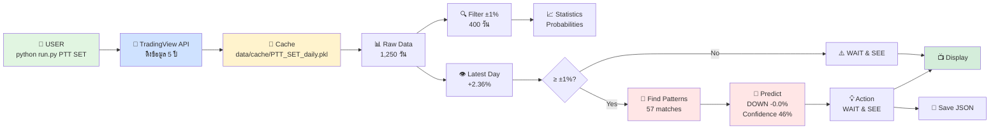

# Flow ภาพรวมทั้งระบบ

## 🎯 จาก Input → Output ผ่านอะไรบ้าง

```
USER พิมพ์: python run.py PTT SET
    ↓
┌─────────────────────────────────────────────────────┐
│  STEP 1: ดึงข้อมูลจาก TradingView                     │
│  ────────────────────────────────────────────────    │
│  • ตรวจสอบ Cache ก่อน (ใน data/cache/)             │
│    - มี Cache → ใช้เลย (0.1 วิ) ⚡                 │
│    - ไม่มี → ดึงจาก TradingView API (3 วิ)         │
│  • ได้ข้อมูล 1,250 วัน (5 ปี)                       │
│  • Format: [date, open, high, low, close, % change]│
└─────────────────────────────────────────────────────┘
    ↓
┌─────────────────────────────────────────────────────┐
│  STEP 2: กรองข้อมูล                                  │
│  ────────────────────────────────────────────────    │
│  • จาก 1,250 วัน                                    │
│  • กรองเฉพาะวันที่เคลื่อนไหว ±1%                    │
│  • ได้ ~400 วัน (significant days)                  │
└─────────────────────────────────────────────────────┘
    ↓
┌─────────────────────────────────────────────────────┐
│  STEP 3: วิเคราะห์สถิติ (Learn from History)        │
│  ────────────────────────────────────────────────    │
│  • แบ่งเป็น:                                        │
│    - วันที่ขึ้น +1%: 198 วัน                       │
│    - วันที่ลง -1%: 197 วัน                         │
│                                                     │
│  • ดูว่าวันถัดไปเป็นอย่างไร:                        │
│    หลังวันขึ้น:                                     │
│    - พรุ่งนี้ขึ้น: 33%                              │
│    - พรุ่งนี้ลง: 41%                                │
│    - พรุ่งนี้ sideways: 26%                         │
│                                                     │
│    หลังวันลง:                                       │
│    - พรุ่งนี้ขึ้น: 39%                              │
│    - พรุ่งนี้ลง: 41%                                │
│    - พรุ่งนี้ sideways: 20%                         │
└─────────────────────────────────────────────────────┘
    ↓
┌─────────────────────────────────────────────────────┐
│  STEP 4: ดูการเคลื่อนไหววันล่าสุด                    │
│  ────────────────────────────────────────────────    │
│  • PTT วันนี้ (2026-01-13): +2.36%                  │
│  • เกิน ±1% ✅ → ทำนายได้!                          │
└─────────────────────────────────────────────────────┘
    ↓
┌─────────────────────────────────────────────────────┐
│  STEP 5: ทำนาย (Historical Pattern Matching)        │
│  ────────────────────────────────────────────────    │
│  • ค้นหาในอดีต:                                     │
│    "เคยมีวันที่ขึ้น +2.36% (±0.5%) กี่ครั้ง?"      │
│                                                     │
│  • พบ 57 ครั้งที่คล้ายกัน                           │
│                                                     │
│  • ดูวันถัดไปของ 57 ครั้งนั้น:                      │
│    - ขึ้น: 19 ครั้ง (33%)                          │
│    - ลง: 26 ครั้ง (46%) ← มากที่สุด!               │
│    - Sideways: 12 ครั้ง (21%)                      │
│                                                     │
│  • คำนวณ:                                           │
│    Direction: DOWN (ตาม % สูงสุด)                  │
│    Expected: -0.02% (ค่าเฉลี่ย)                    │
│    Confidence: 46%                                 │
│    Worst case: +3.2% (ถ้าทายผิด)                   │
└─────────────────────────────────────────────────────┘
    ↓
┌─────────────────────────────────────────────────────┐
│  STEP 6: คำนวณ Action (คำแนะนำ)                      │
│  ────────────────────────────────────────────────    │
│  • ตรวจสอบเงื่อนไข:                                 │
│    - Confidence: 46% (< 60%)                       │
│    - Patterns: 57 (>= 50) ✅                        │
│    - Risk/Reward: 0.8 (< 1.5)                      │
│                                                     │
│  • สรุป: WAIT & SEE (low confidence)               │
└─────────────────────────────────────────────────────┘
    ↓
┌─────────────────────────────────────────────────────┐
│  STEP 7: แสดงผล & บันทึก                             │
│  ────────────────────────────────────────────────    │
│  📺 Console Output:                                 │
│  ┌─────────────────────────────────────────┐       │
│  │ 🔮 PTT Prediction                        │       │
│  │ → Tomorrow: DOWN (-0.0%) at 46%         │       │
│  │ → Risk if wrong: +3.2%                  │       │
│  │ → Action: WAIT & SEE                    │       │
│  │ → Based on 57 patterns                  │       │
│  └─────────────────────────────────────────┘       │
│                                                     │
│  💾 Saved: results/PTT_SET_report.json             │
└─────────────────────────────────────────────────────┘
```

---

## 📊 Data Flow Diagram



---

## 🔄 Module Flow

```
run.py
  │
  ├─→ data_cache.py
  │     └─→ data_fetcher.py
  │           └─→ TradingView API (tvdatafeed)
  │
  ├─→ stats_analyzer.py
  │     ├─ filter_significant_moves()
  │     ├─ analyze_next_day_behavior()
  │     ├─ detect_streaks()
  │     └─ calculate_probabilities()
  │
  ├─→ predictor.py
  │     ├─ _prepare_historical_patterns()
  │     ├─ _find_similar_patterns()
  │     └─ predict_tomorrow()
  │
  └─→ utils.py
        └─ save_to_json()
```

---

## 💡 ข้อมูลที่ไหลผ่านระบบ

### 1. Raw Data (จาก TradingView)
```json
{
  "datetime": "2026-01-13",
  "open": 42.50,
  "high": 43.50,
  "low": 42.25,
  "close": 43.50,
  "volume": 25000000,
  "pct_change": 2.36
}
```

### 2. Filtered Data (±1% เท่านั้น)
```
398 วันที่เคลื่อนไหว ±1% จาก 1,250 วัน
```

### 3. Statistics
```json
{
  "probabilities": {
    "up_after_positive": 33.0,
    "down_after_positive": 41.1,
    "sideways_after_positive": 25.9
  }
}
```

### 4. Patterns
```
วันที่คล้าย PTT +2.36%:
[
  {date: "2024-03-15", change: +2.1%, next_day: -0.5%},
  {date: "2024-07-22", change: +2.4%, next_day: +0.8%},
  ...
  รวม 57 patterns
]
```

### 5. Prediction
```json
{
  "direction": "DOWN",
  "expected_change_avg": -0.02,
  "confidence": 46,
  "risk": {
    "worst_case": 3.2
  }
}
```

### 6. Final Output
```
→ Tomorrow: DOWN (-0.0%) at 46% confidence
→ Risk if wrong: +3.2%
→ Action: WAIT & SEE
```

---

## ⏱️ Timeline

```
0.0s   User รัน python run.py PTT SET
0.1s   ตรวจสอบ Cache → พบ!
0.1s   โหลด 1,250 วัน จาก Cache
0.2s   กรอง ±1% → ได้ 398 วัน
0.3s   วิเคราะห์สถิติ
0.4s   ดูวันล่าสุด: +2.36%
0.5s   ค้นหา patterns → พบ 57
0.6s   คำนวณ prediction
0.7s   คำนวณ action
0.8s   แสดงผล
0.9s   บันทึก JSON
1.0s   เสร็จสิ้น ✅
```

---

## 🎯 สรุปง่าย ๆ

```
INPUT
  PTT, SET
    ↓
FETCH DATA  
  TradingView → 1,250 วัน
    ↓
FILTER
  เอาเฉพาะ ±1% → 398 วัน
    ↓
LEARN
  ดูว่าหลัง ±1% แล้ว วันถัดไปเป็นอย่างไร
    ↓
CHECK TODAY
  วันนี้ +2.36% (เกิน ±1%)
    ↓
FIND PATTERNS
  เคยมีวันที่ขึ้นแบบนี้ 57 ครั้ง
    ↓
PREDICT
  พรุ่งนี้: DOWN (-0.0%) at 46%
    ↓
ACTION
  WAIT & SEE (confidence ต่ำ)
    ↓
OUTPUT
  แสดงผล + บันทึก JSON
```

**ง่าย ๆ คือ: ดึงข้อมูล → กรอง → เรียนรู้ → ทำนาย → แนะนำ!** 🎯
