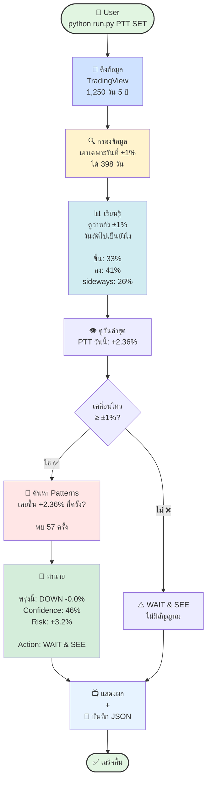
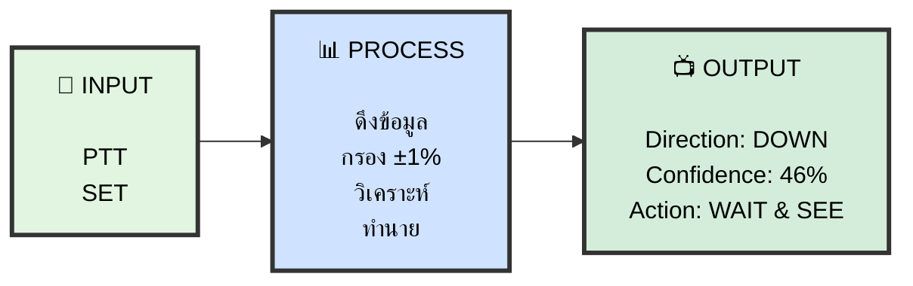
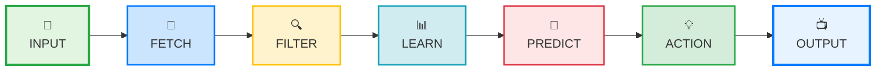

# Simple Flow Diagram

## 🌟 Workflow - จากบนลงล่าง

```mermaid
flowchart TD
    START([� USER INPUT<br/>python run.py PTT SET])
    
    START --> CACHE{💾 มี Cache?<br/>อายุ < 24 ชม.}
    
    CACHE -->|มี ✅| LOAD[📂 โหลด Cache<br/>0.1 วินาที ⚡]
    CACHE -->|ไม่มี ❌| FETCH[📡 ดึงจาก TradingView<br/>3 วินาที]
    
    FETCH --> SAVE[💾 บันทึก Cache]
    SAVE --> DATA
    LOAD --> DATA
    
    DATA[� ได้ข้อมูล 1,250 วัน<br/>date | open | high | low | close | % change]
    
    DATA --> FILTER[🔍 กรอง: เอาเฉพาะวันที่ ±1%<br/>1,250 วัน → 398 วัน]
    
    FILTER --> STATS[� วิเคราะห์สถิติ<br/><br/>หลังวันที่ +1%:<br/>• พรุ่งนี้ขึ้น: 33%<br/>• พรุ่งนี้ลง: 41%<br/>• พรุ่งนี้ sideways: 26%<br/><br/>หลังวันที่ -1%:<br/>• พรุ่งนี้ขึ้น: 39%<br/>• พรุ่งนี้ลง: 41%<br/>• พรุ่งนี้ sideways: 20%]
    
    STATS --> LATEST[👁️ ดูวันล่าสุด<br/>PTT: +2.36%<br/>2026-01-13]
    
    LATEST --> CHECK{เคลื่อนไหว ≥ ±1%?}
    
    CHECK -->|ไม่ ❌| WAIT1[⚠️ WAIT & SEE<br/>ไม่มีสัญญาณชัดเจน]
    
    CHECK -->|ใช่ ✅| SEARCH[🔎 ค้นหา Historical Patterns<br/><br/>เคยมีวันที่ขึ้น +2.36% (±0.5%)<br/>กี่ครั้งในอดีต?<br/><br/>→ พบ 57 ครั้ง]
    
    SEARCH --> ANALYZE[📊 วิเคราะห์ 57 patterns<br/><br/>วันถัดไปของ 57 ครั้งนั้น:<br/>• ขึ้น: 19 ครั้ง 33%<br/>• ลง: 26 ครั้ง 46% ← สูงสุด!<br/>• Sideways: 12 ครั้ง 21%]
    
    ANALYZE --> PREDICT[🎯 ทำนาย<br/><br/>Direction: DOWN<br/>Expected: -0.0% avg<br/>Confidence: 46%<br/>Risk if wrong: +3.2%]
    
    PREDICT --> ACTION[💡 คำนวณ Action<br/><br/>เงื่อนไข:<br/>• Confidence: 46% < 60% ❌<br/>• Patterns: 57 ≥ 50 ✅<br/>• Risk/Reward: 0.8 < 1.5 ❌<br/><br/>→ Action: WAIT & SEE]
    
    ACTION --> OUTPUT
    WAIT1 --> OUTPUT
    
    OUTPUT[📺 แสดงผล<br/><br/>🔮 PTT Prediction<br/>→ Tomorrow: DOWN-0.0% at 46%<br/>→ Risk if wrong: +3.2%<br/>→ Action: WAIT & SEE<br/>→ Based on 57 patterns]
    
    OUTPUT --> SAVE_JSON[💾 บันทึก JSON<br/>results/PTT_SET_report.json]
    
    SAVE_JSON --> END([✅ เสร็จสิ้น])
    
    style START fill:#e1f5e1,stroke:#28a745,stroke-width:3px
    style CACHE fill:#fff3cd,stroke:#ffc107,stroke-width:2px
    style FETCH fill:#cfe2ff,stroke:#007bff,stroke-width:2px
    style DATA fill:#e7f3ff,stroke:#007bff,stroke-width:2px
    style FILTER fill:#fff9e6,stroke:#ffc107,stroke-width:2px
    style STATS fill:#d1ecf1,stroke:#17a2b8,stroke-width:2px
    style SEARCH fill:#ffe6e6,stroke:#dc3545,stroke-width:2px
    style PREDICT fill:#ffd6d6,stroke:#dc3545,stroke-width:2px
    style ACTION fill:#d4edda,stroke:#28a745,stroke-width:2px
    style OUTPUT fill:#e7f3ff,stroke:#007bff,stroke-width:3px
    style END fill:#e1f5e1,stroke:#28a745,stroke-width:3px
```


---

## 🎯 Flow แบบง่ายที่สุด




---

## 📊 Flow แบบ 3 Phase



---

## 🔄 Complete Flow (Vertical)

```mermaid
flowchart TD
    U[👤 User Input<br/>PTT, SET]
    
    U --> C{มี Cache?}
    C -->|มี| C1[ใช้ Cache<br/>0.1 วิ ⚡]
    C -->|ไม่มี| C2[ดึง API<br/>3 วิ]
    
    C1 --> D[📊 Data<br/>1,250 วัน]
    C2 --> D
    
    D --> F[กรอง ±1%<br/>398 วัน]
    
    F --> S[สถิติ<br/>หลัง +1% → พรุ่งนี้?<br/>ขึ้น 33% | ลง 41%]
    
    S --> L[วันล่าสุด<br/>+2.36%]
    
    L --> P{≥ ±1%?}
    
    P -->|Yes| M[Match<br/>57 patterns]
    P -->|No| W1[WAIT & SEE]
    
    M --> R[Predict<br/>DOWN 46%]
    
    R --> A[Action<br/>WAIT & SEE]
    
    A --> O[📺 Output]
    W1 --> O
    
    O --> E[✅ Done]
    
    style U fill:#e1f5e1
    style D fill:#cfe2ff
    style F fill:#fff3cd
    style S fill:#d1ecf1
    style M fill:#ffe6e6
    style R fill:#ffd6d6
    style A fill:#d4edda
    style O fill:#e7f3ff
    style E fill:#e1f5e1
```

---

## 🎨 แบบมี Icon (Horizontal)



---

## สรุป Flow 1 บรรทัด

```
INPUT → FETCH DATA → FILTER ±1% → LEARN STATS → PREDICT TOMORROW → ACTION → OUTPUT
```

**เลือกแบบไหนก็ได้ครับ! ง่ายและชัดเจน 📊**
