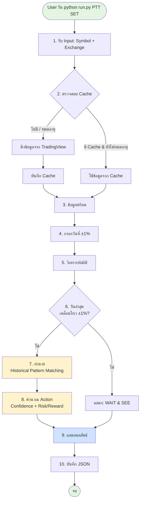
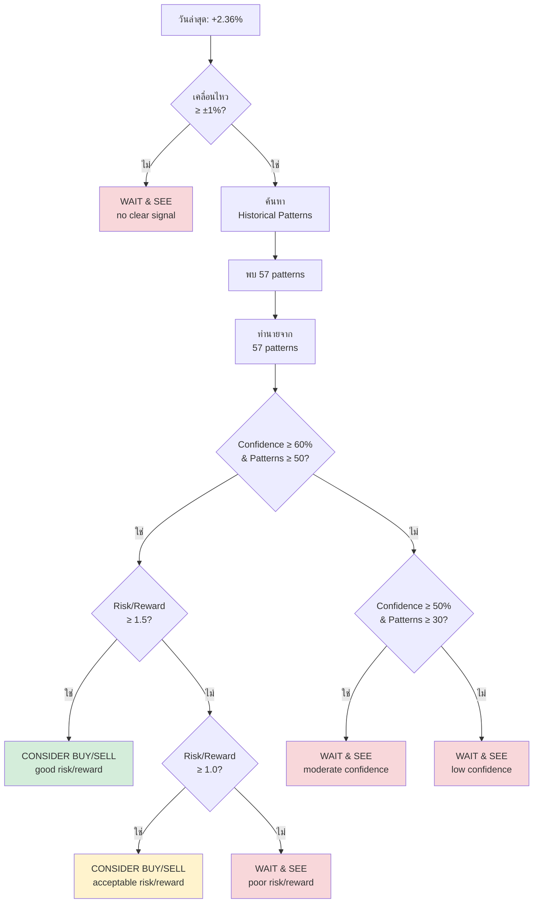
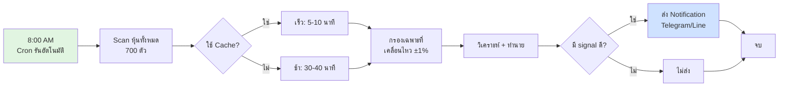

# System Flow - ระบบทำนายหุ้น

## 🔄 Flow การทำงานทั้งระบบ



---

## 📊 Flow แบบละเอียด

### Phase 1: Data Acquisition
```
User Input (PTT, SET)
    ↓
ตรวจสอบ Cache
    ├─ มี Cache (< 24 ชม.) → ใช้ทันที (0.1 วินาที) ⚡
    └─ ไม่มี/หมดอายุ → ดึงจาก TradingView (3 วินาที)
    ↓
ได้ DataFrame: 1,250 วัน × [date, open, high, low, close, volume, % change]
```

### Phase 2: Statistics Analysis
```
ข้อมูล 1,250 วัน
    ↓
กรองเฉพาะวันที่ ±1%
    ↓
ได้ ~400 วัน (significant days)
    ↓
วิเคราะห์วันถัดไป:
    ├─ หลังวันขึ้น +1% → พรุ่งนี้เป็นอย่างไร?
    │   ├─ ขึ้น: 33%
    │   ├─ ลง: 41%
    │   └─ Sideways: 26%
    │
    └─ หลังวันลง -1% → พรุ่งนี้เป็นอย่างไร?
        ├─ ขึ้น: 39%
        ├─ ลง: 41%
        └─ Sideways: 20%
```

### Phase 3: Prediction (ถ้าวันนี้ ±1%)
```
วันนี้: PTT +2.36% ✅
    ↓
ค้นหา Historical Patterns:
    "เคยมีวันที่ขึ้น +2.36% (±0.5%) กี่ครั้ง?"
    ↓
พบ 57 patterns คล้ายกัน
    ↓
ดูวันถัดไปของ 57 ครั้งนั้น:
    ├─ ขึ้น: 19 ครั้ง (33%)
    ├─ ลง: 26 ครั้ง (46%) ← มากที่สุด!
    └─ Sideways: 12 ครั้ง (21%)
    ↓
คำนวณ:
    ├─ Direction: DOWN (ตาม probability สูงสุด)
    ├─ Expected: -0.02% (ค่าเฉลี่ย)
    ├─ Confidence: 46% (จาก probability)
    └─ Risk: +3.2% (worst case จาก 57 patterns)
```

### Phase 4: Action Recommendation
```
Confidence: 46%
Patterns: 57
Risk/Reward: 0.8
    ↓
ตรวจสอบเงื่อนไข:
    ├─ Confidence ≥ 60% + Patterns ≥ 50? → ❌
    ├─ Confidence ≥ 50% + Patterns ≥ 30? → ❌
    └─ อื่นๆ → ✅
    ↓
Action: WAIT & SEE (low confidence)
```

---

## 🎯 Output Flow

```
📊 CONSOLE OUTPUT
├─ สถิติโดยรวม (1,249 วัน)
├─ ความน่าจะเป็น (หลัง ±1%)
├─ 🔮 Prediction
│   ├─ Tomorrow: DOWN (-0.0%) at 46% confidence
│   ├─ Risk if wrong: +3.2%
│   ├─ Action: WAIT & SEE
│   └─ Based on 57 patterns
└─ สถิติเพิ่มเติม

💾 JSON FILE (results/PTT_SET_report.json)
├─ total_days: 1249
├─ significant_days: 395
├─ probabilities: {...}
├─ next_day_stats: {...}
└─ risk_metrics: {...}
```

---

## 🔍 Decision Logic Flow



---

## 💡 Key Concepts

### 1. Historical Pattern Matching
```
วันนี้ PTT +2.36%
    ↓
ค้นหาในอดีต: "เคยมีวันที่ขึ้น +1.86% ถึง +2.86% กี่ครั้ง?"
    ↓
พบ 57 ครั้ง
    ↓
ดูวันถัดไป → สรุปเป็นสถิติ
```

### 2. Confidence Calculation
```
Confidence = (จำนวนที่ทายถูก / จำนวนทั้งหมด) × 100

ตัวอย่าง:
- ทาย DOWN
- จาก 57 patterns → 26 ครั้งที่ลงจริง
- Confidence = 26/57 × 100 = 46%
```

### 3. Risk Assessment
```
จาก 57 patterns:
- Best case: ลงมากที่สุด -2.56%
- Worst case: ขึ้นมากที่สุด +3.21%
- Average: -0.02%
```

---

## 🚀 Daily Suggest Flow



---

**สรุป:** ระบบใช้ Pure Historical Pattern Matching ไม่มี ML model - ทุกอย่างมาจากข้อมูลจริง 100% 📊
